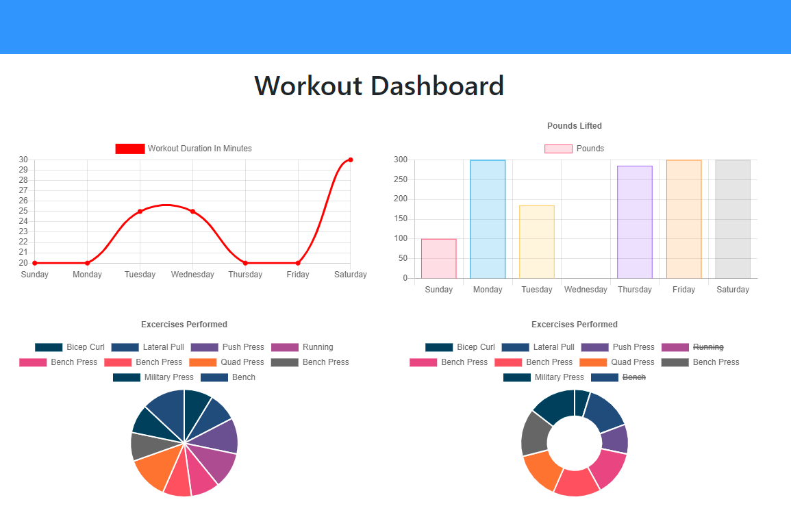

# Fitness Tracker
The visitor is able to track a workout. Various attributes of the workout can be stored. The workouts are saved in a Mongo database.

## Description 
Created a fitness tracking application utilizing Node.js, Express.js, MongoDB, Heroku and Mongoose. Allows the user to track their workouts and then save them in a database.

## Heroku app: 
https://jpf-workout-tracker.herokuapp.com/

## Image
Image of Workout Dashboard

## Installation 
To install you will need to npm init to get all the required node modules. If you are running the code locally the local host is set to port 3000. You will also need to go in to the config folder and possibly change the config.json values. The file I used to start the project is server.js.

## License
[MIT](https://choosealicense.com/licenses/mit/)
